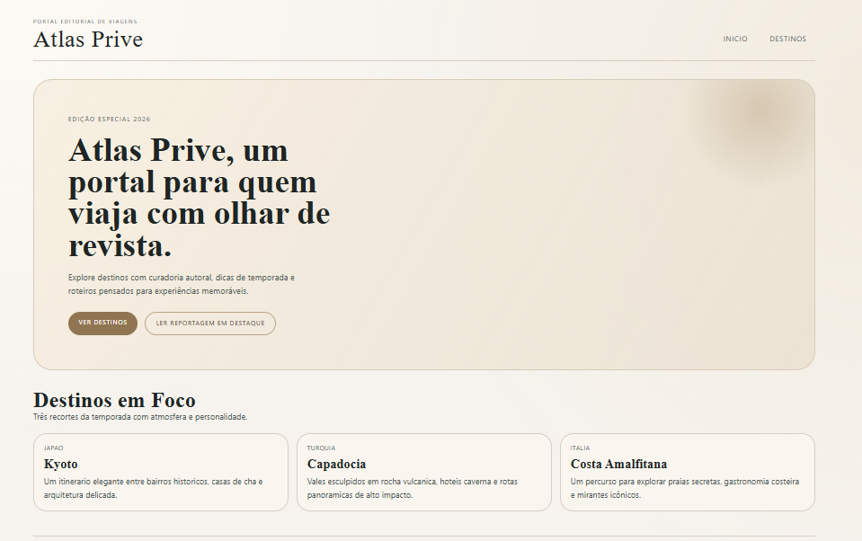
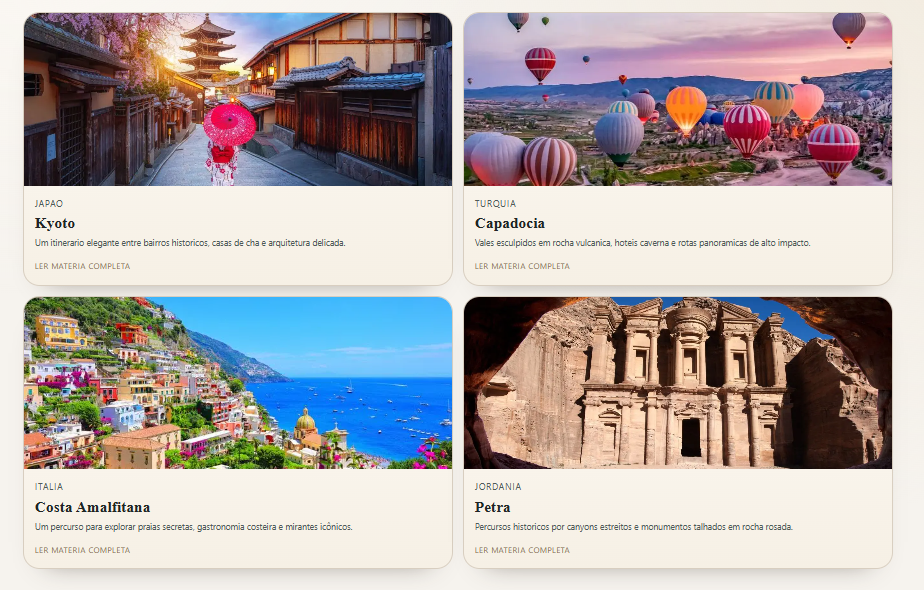

# Atlas Prive | Premium Travel Portal


Aplicacao web desenvolvida com **Next.js (App Router)** para simular um portal editorial de viagens com estetic a premium.  
O projeto foca em **componentizacao, rotas dinamicas e UX visual refinada**.

## Resumo (Recruiter-Friendly)

Este projeto demonstra capacidade de:
- Construir aplicacao moderna com Next.js e TypeScript
- Estruturar layout reutilizavel e componentes desacoplados
- Implementar roteamento dinamico baseado em arquivo
- Aplicar identidade visual consistente com CSS Modules
- Organizar codigo com separacao clara de responsabilidades

## Demo

- Ambiente local: `http://localhost:3000`
- Rotas principais:
  - `/`
  - `/destinos`
  - `/destinos/[slug]`

## Screenshots





## Funcionalidades

- Home com apresentacao do portal e CTA para navegacao
- Listagem com 4+ destinos turisticos
- Pagina dinamica por destino (`[slug]`)
- Menu global com `next/link` em todas as paginas
- Card de destino com imagem, nome e chamada editorial
- Pagina de fallback para destino inexistente (`not-found`)

## Stack

- Next.js 16
- React 19
- TypeScript
- CSS Modules
- ESLint

## Arquitetura de Pastas

```bash
portal-viagens-premium/
├─ app/
│  ├─ destinos/
│  │  ├─ [slug]/
│  │  │  ├─ page.tsx
│  │  │  └─ destinoDetalhe.module.css
│  │  ├─ page.tsx
│  │  └─ destinos.module.css
│  ├─ globals.css
│  ├─ layout.tsx
│  ├─ not-found.tsx
│  ├─ not-found.module.css
│  ├─ page.tsx
│  └─ page.module.css
├─ components/
│  ├─ CardDestino/
│  └─ Layout/
├─ data/
│  └─ destinos.ts
├─ public/images/
└─ docs/images/
